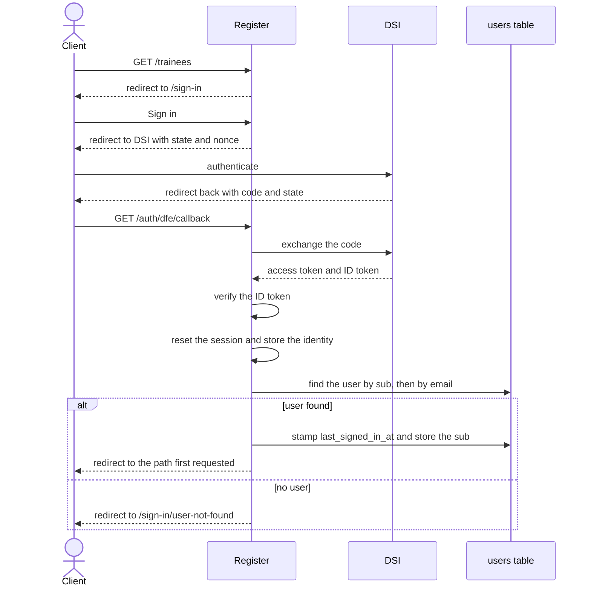

# Authentication

Register has three sign in modes and only one is active at a time.
`Settings.features.sign_in_method` selects which one.

- `dfe-sign-in` is the default and is used in staging, sandbox, pen, production data and production.
- `otp` is the fallback for when DSI is unavailable.
- `persona` is used in development, review and QA.

## Basic Auth

The QA, review and production data environments are protected by basic auth. The username and
password can be provided by a Register team member. It is on by default, so a new environment gets
it unless `features.basic_auth` is set to `false`. The `/metrics` path is not protected.

## DSI

DSI is DfE's identity service, used by services across the organisation including Register to
authenticate their users. You need a DfE Sign in account to access the staging, sandbox, pen,
production data and production environments.

It uses OpenID Connect (OIDC) on top of OAuth 2.0. Register uses it to authenticate only. DSI
answers who the person is. Register decides what they can do from its own user record, the
providers or training partners attached to it and its `system_admin` flag. No roles or organisation
data come from DSI and the access token it issues is never stored or used.

### User records

Register keeps its own `users` table. A DSI account on its own does not grant access. A system
admin has to create the user in Register first and attach them to a provider or training partner.
Signing in never creates a record. A user with no record is sent to `/sign-in/user-not-found`.

On the first sign in the DSI `sub` is stored on the record as `dfe_sign_in_uid` and from then on
that is what matches the person to their record instead of their email. Removing a user is a soft
delete (`discarded_at`) and every lookup is scoped to `User.kept`, so a removed user loses access
on their next request.



Authentication Flow:

1. A client either attempts to click Sign in or access any protected route like `/trainees/`. In
   the second case the requested path is saved in the session and the client is redirected to
   `/sign-in`.
2. A redirect is performed to DSI with the authorization code flow, sending a state and a nonce.
3. The user authenticates with DSI. Their credentials are entered on DSI, not on Register.
4. Once DSI authenticates the user, the client is redirected back to Register with the DSI code
   and state.
5. Register checks if the state received from DSI matches for that attempt, then posts the code
   back to DSI to exchange it for an access token and an ID token.
6. Register verifies the ID token against DSI's published keys and checks its issuer, audience,
   expiry and nonce.
7. Register resets the session and stores the identity from the ID token (email, sub, name). The
   session itself is kept in the database and the cookie holds only the session id.
8. Register looks up the user record by DSI sub, falling back to email. If there is no record the
   session is discarded and the client is sent to `/sign-in/user-not-found`.
9. If the user is found, `last_signed_in_at` is stamped and the DSI sub is stored against the
   record. The client is redirected to the path originally requested, or to `/organisations` if
   they belong to more than one.
10. The session lasts two hours of inactivity. DSI is not contacted again until sign out.

### Sign out

Register ends its own session first. It then sends the client to DSI with the ID token it stored at
sign in, which asks DSI to end its session too. DSI then redirects the client back to Register.

### Configuration

DSI is one of three sign in modes. `Settings.features.sign_in_method` selects which one the app
uses and `dfe-sign-in` is the default. The other two are `otp` and `persona`, used in
non-production environments. The value is read at boot in `config/initializers/omniauth.rb`, which
mounts the OmniAuth strategy and in `config/routes.rb`, which defines the callback routes.

The DSI client settings live under `dfe_sign_in` in `config/settings.yml`, with per-environment
overrides:

| Key | Meaning |
|---|---|
| `identifier` | OIDC client id. `rtt` |
| `secret` | OIDC client secret. The value in the file is a placeholder and the real one is injected from the environment. Sign in fails if it is not set |
| `issuer` | OIDC issuer. Test `https://test-oidc.signin.education.gov.uk`, pre-production `https://pp-oidc.signin.education.gov.uk`, production `https://oidc.signin.education.gov.uk` |

`dfe_sign_in.profile` is also set per environment but nothing in the app reads it.

Any of these can be overridden per environment, see [configuration](configuration.md).

## OTP

OTP is the fallback sign in mode, used when DSI is unavailable. Instead of signing in with DSI the
user gets a one time code by email. The sign in page says that DfE Sign in is currently
unavailable.

No environment uses it by default. It is switched on by setting
`Settings.features.sign_in_method` to `otp`, which also removes the DSI routes because the modes
are mutually exclusive.

The user still needs a record in Register. A code only proves that the person owns the mailbox.

Sign out only ends the Register session, because there is no identity provider to sign out of.

Authentication Flow:

1. A client goes to `/request-sign-in-code` and enters their email.
2. Register validates the email and allows two requests a minute.
3. Register stores the email and a new salt in the session.
4. If the email belongs to a user, Register generates a code and sends it with GOV.UK Notify. If it
   does not, nothing is sent but the client still sees the next page, so the form cannot be used to
   find out who has an account.
5. The client enters the code at `/sign-in-code`.
6. Register rebuilds the code from the user's secret and the salt, then compares it. Five attempts
   are allowed every five minutes and the code is valid for ten minutes.
7. If the code matches, Register stores the email in the session and deletes the salt so the code
   cannot be used again.
8. From then on Register matches the session to a user record by email. The session lasts two hours
   of inactivity, the same as DSI.

### Codes

Each user has a permanent secret in the `users` table, stored encrypted. The code is generated from
that secret plus a salt that only exists in the current session, so a code only works in the
browser that asked for it.

### Configuration

Enabled when `Settings.features.sign_in_method == "otp"`. The Notify template is
`govuk_notify.otp_email_template_id` and the request and verification limits are under
`otp.throttling` in `config/settings.yml`.

## Personas

Personas are a fake sign in mode for non-production environments. Instead of DSI you get a page
listing seeded users with a button to sign in as any of them. It is used in development, review
and QA.

There is no password and no identity provider. Everything after the sign in itself behaves in the
same way as DSI. Sign out only ends the Register session, because there is no identity provider to
sign out of.

Authentication Flow:

1. A client goes to `/sign-in` and follows the link to `/personas`, or is redirected there from a
   protected route.
2. `/personas` lists the personas with the provider or training partner they belong to.
3. Clicking "Login as X" posts that persona's email and name to `/auth/developer/callback`.
4. Register stores the identity in the session in the same way as DSI.
5. Register looks up the user record by email. If there is no record the client is sent to
   `/sign-in/user-not-found`.

### Who appears in the list

Five personas are defined in `config/initializers/personas.rb`. One is a system admin and the rest
belong to providers or training partners. The list also includes one user from each of the ten
providers with the most trainees, which is what makes it useful against a sanitised database dump.

You can add your own persona locally, see [setting up development](setup-development.md).

### Seeding

Personas are not created when you sign in. They come from `bin/rails example_data:generate`, which
creates the users, their providers and a set of trainees.

### Configuration

Enabled when `Settings.features.sign_in_method == "persona"`.

## TRS

To work with TRS locally, you will need to set the following information in your `development.local.yml`:

```yml
trs:
  base_url: https://dev.teacher-qualifications-api.education.gov.uk/
  api_key: dev password
