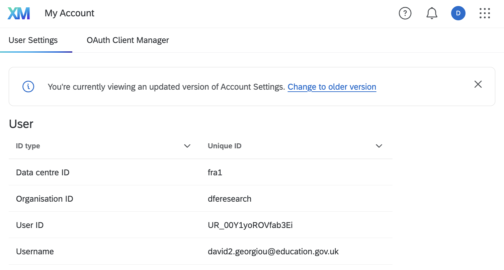

# Qualtrics

## Test credentials

Many lists, directories, survey and message IDs are required when using Qualtrics. Here are the ones that were used for
testing this integration during development:
> note: these may need sharing by David Georgiou. Alternatively, you can set up equivalents for your own testing.

* [Directory](https://dferesearch.eu.qualtrics.com/iq-directory/#/POOL_03wzmFoShC0dJRP/groups/lists)
* [Mailing List](https://dferesearch.eu.qualtrics.com/iq-directory/#/POOL_03wzmFoShC0dJRP/groups/lists/CG_3OdM42XilFOtZRm)
* [Survey](https://dferesearch.eu.qualtrics.com/survey-builder/SV_9YMMtN3i5UBgB7w/edit?SurveyID=SV_9YMMtN3i5UBgB7w)
* [Messages](https://dferesearch.eu.qualtrics.com/app/library#libraryID=UR_00Y1yoROVfab3Ei&page=1)

## Finding Qualtrics IDs 

* You can view all IDs you have permission to see [here](https://dferesearch.eu.qualtrics.com/Q/QualtricsIdsSection/IdsSection)
* If you don't see this page you may need to go to your [account settings dashboard](https://dferesearch.eu.qualtrics.com/admin/account-settings-portal/user-settings) and select "change to older version" (see image below)

* Other methods for obtaining necessary ids can be found [here](https://www.qualtrics.com/support/integrations/api-integration/finding-qualtrics-ids/)

## API Key

API keys can be generated on the [dashboard page](https://dferesearch.eu.qualtrics.com/admin/account-settings-portal/user-settings). When generating a new key:

1. Go to Account Settings > Qualtrics IDs
2. Under API, select "Generate Token"

## Testing the Integration

For testing the integration locally or in development environments, add your Qualtrics config
to `config/settings/development.local.yml`:

```yaml
qualtrics:
  base_url: "https://fra1.qualtrics.com/API/v3/" # double check `fra1` is being used in your account
  api_token: "your_api_token"
  directory_id: "POOL_03wzmFoShC0dJRP"
  library_id: "UR_00Y1yoROVfab3Ei"
  days_delayed: 7
  minutes_delayed: 0
  withdraw:
    survey_id: "SV_9YMMtN3i5UBgB7w"
    mailing_list_id: "CG_3OdM42XilFOtZRm"
    message_id: "MS_BVPUxTGNx01TwZG"
  award:
    survey_id: "SV_9YMMtN3i5UBgB7w"
    mailing_list_id: "CG_3OdM42XilFOtZRm"
    message_id: "MS_BVPUxTGNx01TwZG"
```

## Additional Resources

* [Qualtrics API Documentation](https://api.qualtrics.com/)
* [API Integration Guide](https://www.qualtrics.com/support/integrations/api-integration/)
